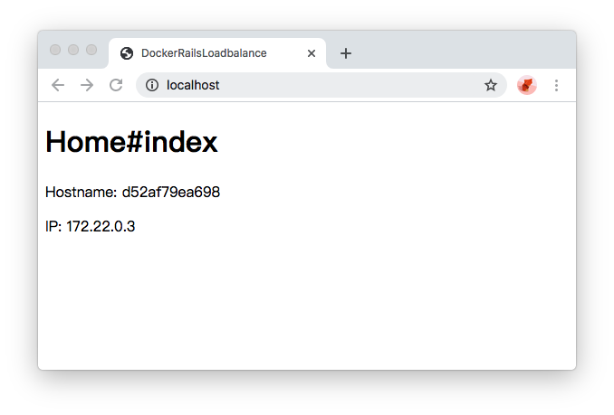

## Use nginx and rails config load balance

Source code: [https://github.com/anxgang/lbnr](https://github.com/anxgang/lbnr)

**Requirement**
- docker
- docker-compose

### I. Build rails app image

HomeHelper

```ruby
require 'socket'

module HomeHelper
  def local_ip
    orig, Socket.do_not_reverse_lookup = Socket.do_not_reverse_lookup, true  # turn off reverse DNS resolution temporarily

    UDPSocket.open do |s|
      s.connect '192.168.99.100', 1
      s.addr.last
    end
  ensure
    Socket.do_not_reverse_lookup = orig
  end
end

```

Home#index

```html
<h1>Home#index</h1>
<p>Hostname: <%= Socket.gethostname %></p>
<p>IP: <%= local_ip %></p>
```

route

```ruby
Rails.application.routes.draw do
  root 'home#index'
end
```


Dockerfile

```dockerfile
FROM ruby:2.7.1

ENV BUNDLE_PATH /usr/local/bundle
ENV RAILS_SERVE_STATIC_FILES true
ENV RAILS_ENV production

ADD Gemfile /lbnr/Gemfile
ADD Gemfile.lock /lbnr/Gemfile.lock
RUN cd /lbnr && bundle install
ADD . /lbnr
WORKDIR /lbnr
RUN rake assets:precompile

ENTRYPOINT ["bundle","exec","rails","s","-e","production","-b","0.0.0.0"]
CMD ["-p","3000"]
```

Build lbnr_app image
```shell
docker build -t lbnr_app .
```

### II. Build nginx image

Dockerfile

```dockerfile
FROM nginx:latest

RUN rm -fr /usr/share/nginx/html
ADD nginx.conf /etc/nginx/conf.d/default.conf
```

### III. Start 3 App Server

docker-compose.yml

```yml
version: '3'
services:
  app1:
    image: lbnr_app
    command: -p 3001
    ports:
      - "3001:3001"
    container_name: "app1"
  app2:
    image: lbnr_app
    command: -p 3002
    ports:
      - "3002:3002"
    container_name: "app2"
  app3:
    image: lbnr_app
    command: -p 3003
    ports:
      - "3003:3003"
    container_name: "app3"
  web:
    image: lbnr_web
    build: ./nginx/
    ports:
      - 80:80
    container_name: "web"
```

```shell
docker-compose up
```

### IV. Result




---
Reference:  
- [https://github.com/zhulinpinyu/lbnr](https://github.com/zhulinpinyu/lbnr)
- [http://vps816932.ovh.net/2014/02/06/rails-cluster-with-ruby-load-balancer-using-docker/](http://vps816932.ovh.net/2014/02/06/rails-cluster-with-ruby-load-balancer-using-docker/)
- [https://github.com/Muriel-Salvan/rails-cluster-docker/tree/master/server](https://github.com/Muriel-Salvan/rails-cluster-docker/tree/master/server)
